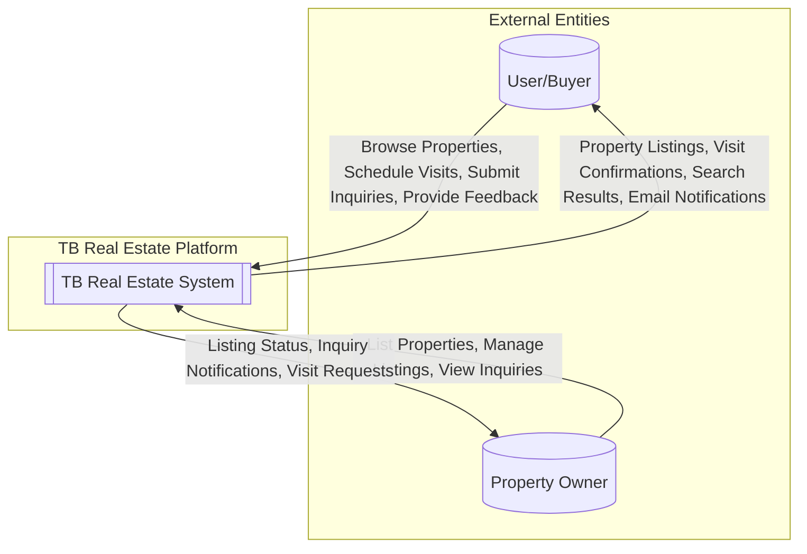
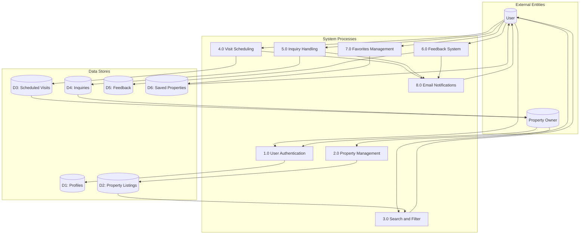
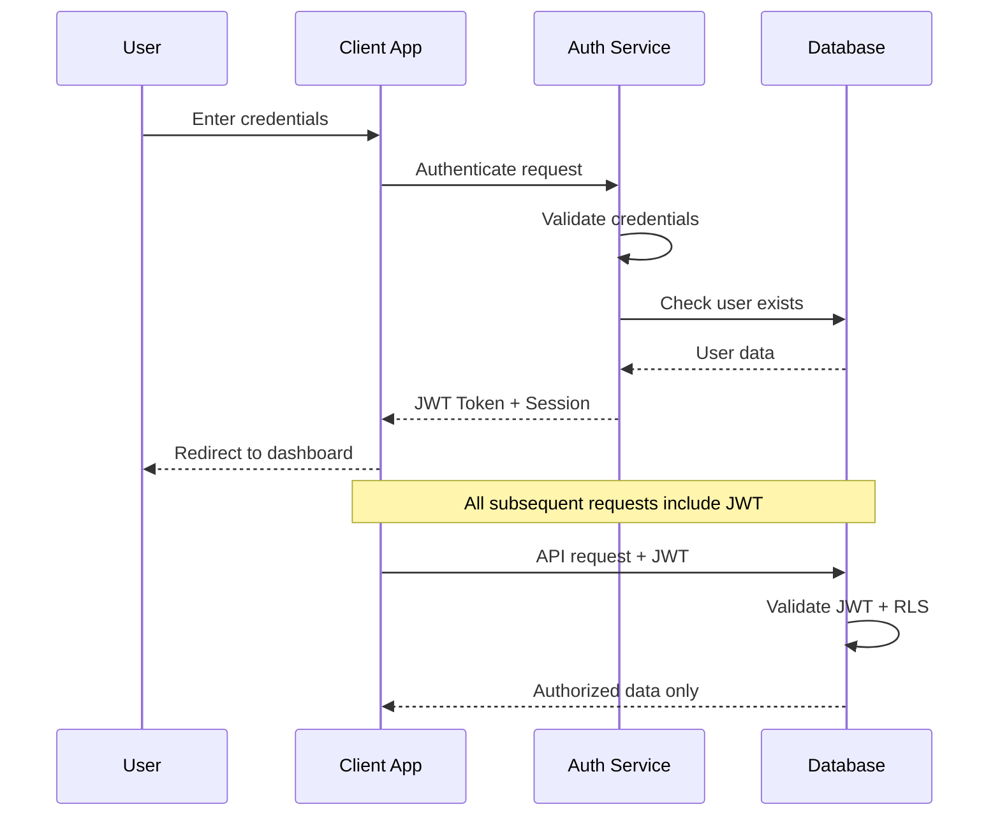

# Agile Project Documentation

**(For MCA Semester II — Agile CI-Based Project)**

---

## Project Title

**TB Real Estate Platform – Property Listing & Management System**

**Project Status:** 🟢 **Completed**

**Last Updated:** March 2026

---

## 1. Project Overview

### 1.1 Team Members

| **Name** | **Role** |
|----------|----------|
| **Thejazo Tachu** | Scrum Master, Frontend Developer |
| **Bageesh Kumar Sharma** | Product Owner, Backend Developer, Tester |

### 1.2 Abstract

TB Real Estate Platform is a modern, web-based real estate property listing and management system designed to simplify the interaction between home buyers and property owners. The platform enables users to explore residential properties such as 1BHK to 4BHK apartments, villas, and duplex homes across multiple Indian states.

The system provides advanced property search and filtering, detailed property pages with image galleries, user authentication, property comparison, inquiry handling, visit scheduling, and feedback mechanisms.

The project was developed using the **Agile methodology**, ensuring incremental delivery, adaptability to change, and continuous feedback. The frontend is implemented using **React 18 with TypeScript**, while the backend leverages **PostgreSQL with Row Level Security (RLS)** for secure data access.

**Current Status:** The project has been successfully completed across 5 development sprints. All core features, user interaction modules, email notification systems, and documentation have been finalized and delivered.

---

## 2. Technology Stack (Implemented)

### 2.1 Frontend Technologies

| **Technology** | **Purpose** | **Status** |
|----------------|-------------|------------|
| React 18 | UI Development | ✅ Implemented |
| TypeScript | Type Safety | ✅ Implemented |
| Vite | Build Tool | ✅ Implemented |
| Tailwind CSS | Styling | ✅ Implemented |
| shadcn/ui | UI Components | ✅ Implemented |
| React Router DOM v6 | Routing | ✅ Implemented |
| TanStack React Query | Data Fetching | ✅ Implemented |
| React Hook Form + Zod | Form Validation | ✅ Implemented |
| Lucide React | Icons | ✅ Implemented |
| Framer Motion | Animations | ✅ Implemented |
| Recharts | Data Visualization | ✅ Implemented |

### 2.2 Backend Technologies

| **Technology** | **Purpose** | **Status** |
|----------------|-------------|------------|
| PostgreSQL | Database | ✅ Implemented |
| Authentication Service | User Login/Signup | ✅ Implemented |
| Row Level Security | Data Protection | ✅ Implemented |
| Edge Functions | Serverless Logic | ✅ Implemented |
| Resend API | Email Notifications | ✅ Implemented |

---

## 3. System Architecture

### 3.1 High-Level Architecture

The system follows a three-tier architecture consisting of:

- **Client Layer**: Web browsers (Desktop, Tablet, Mobile)
- **Application Layer**: React-based frontend with TypeScript
- **Data Layer**: PostgreSQL database with RLS policies

This architecture ensures scalability, maintainability, and secure data access.

```
┌─────────────────────────────────────────────────────────────────┐
│                        CLIENT LAYER                              │
│  ┌─────────────┐  ┌─────────────┐  ┌─────────────┐              │
│  │   Desktop   │  │   Tablet    │  │   Mobile    │              │
│  └─────────────┘  └─────────────┘  └─────────────┘              │
└─────────────────────────────────────────────────────────────────┘
                              │
                              ▼
┌─────────────────────────────────────────────────────────────────┐
│                     PRESENTATION LAYER                           │
│  ┌──────────────────────────────────────────────────────────┐   │
│  │  React 18 + TypeScript + Vite + Tailwind CSS + shadcn/ui │   │
│  └──────────────────────────────────────────────────────────┘   │
└─────────────────────────────────────────────────────────────────┘
                              │
                              ▼
┌─────────────────────────────────────────────────────────────────┐
│                      BACKEND LAYER                               │
│  ┌─────────────────────┐  ┌─────────────────────────────────┐   │
│  │  REST API Layer     │  │  Authentication (Email/Password) │   │
│  └─────────────────────┘  └─────────────────────────────────┘   │
│  ┌─────────────────────┐  ┌─────────────────────────────────┐   │
│  │  Edge Functions     │  │  Email Service (Resend API)      │   │
│  └─────────────────────┘  └─────────────────────────────────┘   │
└─────────────────────────────────────────────────────────────────┘
                              │
                              ▼
┌─────────────────────────────────────────────────────────────────┐
│                       DATA LAYER                                 │
│  ┌─────────────────────────────────────────────────────────┐    │
│  │  PostgreSQL Database with Row Level Security (RLS)       │    │
│  │  Tables: profiles, property_listings, saved_properties,  │    │
│  │          scheduled_visits, inquiries, feedback           │    │
│  └─────────────────────────────────────────────────────────┘    │
└─────────────────────────────────────────────────────────────────┘
```

---

## 4. Database Design

### 4.1 Entity-Relationship (ER) Diagram


### 4.2 Table Specifications

| **Table** | **Purpose** | **RLS Policies** | **Status** |
|-----------|-------------|------------------|------------|
| `profiles` | User profiles | User-specific access | ✅ Active |
| `property_listings` | Property data | Owner + approved public | ✅ Active |
| `saved_properties` | User favorites | User-specific | ✅ Active |
| `scheduled_visits` | Visit bookings | User-specific | ✅ Active |
| `inquiries` | Property inquiries | Submitter + Owner view | ✅ Active |
| `feedback` | User reviews | Approved public | ✅ Active |

---

## 5. Data Flow Diagram (DFD)

### 5.1 Level-0 DFD (Context Diagram)



### 5.2 Level-1 DFD



---

## 6. Problem Statement

Traditional real estate platforms suffer from:

| **Problem** | **Impact** | **Our Solution** |
|-------------|------------|------------------|
| Cluttered UI | Poor user experience | Modern, clean React-based interface |
| Poor discovery | Users can't find properties | Advanced filtering by location, price, BHK |
| Limited comparison | Difficult decision-making | Built-in property comparison tool |
| Incomplete information | Uninformed decisions | Detailed specs + image galleries |
| No visit scheduling | Manual coordination | Integrated visit booking with email confirmation |
| No authentication | No personalization | Email/password auth with profiles |
| No communication channel | Users can't reach owners | Inquiry and feedback systems with notifications |

---

## 7. Proposed Solution

The TB Real Estate Platform addresses these challenges by offering:

- Advanced search and filtering (location, price, BHK type, state)
- Responsive, modern UI accessible on desktop, tablet, and mobile
- Secure user authentication with email/password
- Property comparison for informed decision-making
- Visit scheduling with email confirmation notifications
- Inquiry handling and feedback systems
- Scalable architecture built for future enhancements

---

## 8. Agile Methodology

### 8.1 Agile Practices Followed

- ✅ Sprint-based development (5 sprints across 5 weeks)
- ✅ User stories with acceptance criteria
- ✅ Incremental feature delivery
- ✅ Continuous testing during development
- ✅ Regular sprint reviews and retrospectives

### 8.2 Team Roles & Responsibilities

| **Role** | **Member** | **Responsibilities** |
|----------|------------|----------------------|
| Product Owner | Bageesh Kumar Sharma | Define requirements, manage backlog, accept stories |
| Scrum Master | Thejazo Tachu | Facilitate Scrum, remove blockers, ensure practices |
| Frontend Developer | Both | UI/UX, React components, responsive design |
| Backend Developer | Bageesh Kumar Sharma | Database design, RLS policies, API integration |
| Tester | Bageesh Kumar Sharma | Test cases, bug tracking, UAT |
| DevOps | Both | Deployment, version control |

---

## 9. Product Backlog Summary

| **Epic** | **Status** |
|----------|------------|
| Core Property Browsing | ✅ Completed |
| User Authentication | ✅ Completed |
| Favorites & Visits | ✅ Completed |
| Feedback & Inquiry | ✅ Completed |
| Property Owner Listing | ✅ Completed |
| Email Notifications | ✅ Completed |
| Property Comparison | ✅ Completed |

### Product Backlog Summary (Detailed Discussion)

Before development began, the team conducted detailed discussions to understand real-world real estate challenges, user expectations, and overall project feasibility. Based on these discussions, the product backlog was created and prioritized.

The **Core Property Browsing** module was identified as the highest priority and has been fully implemented and tested. **User Authentication** was treated as a critical requirement and includes secure login, registration, and session management, all of which have been successfully validated. Following authentication, the **Favorites and Visit Scheduling** features were developed to allow users to save properties and schedule visits, and these features are functioning as expected.

The **Feedback and Inquiry** module was implemented to enable effective communication between users and property owners and has been completed successfully. The **Property Owner Listing** feature has been implemented with property submission functionality. The **Email Notification** system was integrated using Resend API via Edge Functions to send welcome emails, visit confirmations, inquiry acknowledgments, and feedback notifications. The **Property Comparison** tool enables users to compare up to 3 properties side-by-side.

---

## 10. Sprint Progress

---

### Sprint 1 (Week 1): Foundation Setup — COMPLETED

**Previous Sprint Reference:**
This was the initial sprint of the project. Prior to development, requirement analysis was conducted, the technology stack was finalized, and the development environment was prepared.

**Tasks Completed in This Sprint:**

1. Project initialization using Vite, React 18, and TypeScript
2. Installation and configuration of Tailwind CSS and shadcn/ui
3. Setup of React Router DOM v6 for client-side routing
4. Development of Header component with navigation links
5. Development of Footer component with contact and social links
6. Creation of Home page with hero section and featured properties
7. Development of About page with company and team information
8. Implementation of Contact page with inquiry form structure
9. Configuration of responsive layout for mobile, tablet, and desktop

**Role-wise Contribution:**

**Thejazo Tachu (Scrum Master, Frontend Developer):**
- Facilitated sprint planning and daily stand-up coordination
- Set up frontend project structure and routing
- Developed Header and Footer components with responsive design
- Implemented Home page layout with hero section and navigation flow
- Ensured mobile-first responsive design across all pages

**Bageesh Kumar Sharma (Product Owner, Backend Developer, Tester):**
- Defined user stories and acceptance criteria for Sprint 1
- Assisted in repository setup and version control workflow
- Developed About page with company and team information content
- Designed Contact page structure and form layout
- Performed initial testing of routing and navigation

**Sprint Outcome:**
A stable project foundation was established with responsive navigation, three core pages (Home, About, Contact), and a scalable frontend component architecture for subsequent development.

---

### Sprint 2 (Week 2): Property Features — COMPLETED

**Previous Sprint Reference:**
Building upon the foundation established in Sprint 1, the team proceeded to implement the core property listing functionality. The routing and UI foundation developed in Sprint 1 enabled seamless integration of property-related features.

**Tasks Completed in This Sprint:**

1. Creation of comprehensive property data structure with 45+ properties across 12 Indian states
2. Development of Properties listing page with grid layout
3. Implementation of advanced filtering system (location, price range, BHK type, state)
4. Creation of reusable PropertyCard component with image, specifications, and pricing
5. Development of PropertyDetail page with image gallery
6. Implementation of property specifications display (area, bedrooms, bathrooms, amenities)
7. Addition of property type categories (1BHK, 2BHK, 3BHK, 4BHK, Villa, Duplex)
8. Integration of search functionality with real-time filtering
9. Development of Services page with company offerings

**Role-wise Contribution:**

**Thejazo Tachu (Scrum Master, Frontend Developer):**
- Coordinated sprint review sessions and backlog refinement
- Developed Properties listing page UI with filter sidebar
- Implemented advanced filtering and search logic for multiple criteria
- Created PropertyCard and image gallery components
- Maintained consistent UI styling using Tailwind CSS design tokens

**Bageesh Kumar Sharma (Product Owner, Backend Developer, Tester):**
- Curated and validated property data for 45+ listings across multiple states
- Designed property data schema with comprehensive attributes
- Developed PropertyDetail page with full specifications display
- Created Services page with service offerings
- Conducted functional testing of filter combinations and listing accuracy

**Sprint Outcome:**
A fully functional property browsing module with advanced filtering, detailed property views with image galleries, and comprehensive property information across multiple Indian states was delivered.

---

### Sprint 3 (Week 3): User Authentication & Interaction — COMPLETED

**Previous Sprint Reference:**
With property browsing features completed in Sprint 2, the focus shifted to implementing user authentication and personalized interaction features. The property infrastructure enabled the development of user-specific functionalities.

**Tasks Completed in This Sprint:**

1. Integration of backend database (PostgreSQL) with Row Level Security
2. Implementation of user signup and login functionality (email/password)
3. Creation of user profiles table and related database tables
4. Development of saved properties feature with database persistence
5. Implementation of visit scheduling functionality with date and time selection
6. Development of inquiry submission system with database storage
7. Creation of feedback and rating system
8. Development of My Visits page for viewing scheduled appointments
9. Development of Saved Properties page for viewing favorites

**Role-wise Contribution:**

**Thejazo Tachu (Scrum Master, Frontend Developer):**
- Coordinated sprint activities and resolved blockers
- Developed authentication UI components (login/signup forms)
- Created ScheduleVisitModal component with form validation
- Implemented UserMenu component with dropdown navigation
- Developed My Visits and Saved Properties pages
- Integrated UI feedback and toast notifications

**Bageesh Kumar Sharma (Product Owner, Backend Developer, Tester):**
- Designed database schema and implemented RLS policies for all tables
- Integrated backend authentication services with email/password
- Developed AuthContext for global authentication state management
- Implemented CRUD operations for user features (favorites, visits, inquiries)
- Conducted end-to-end testing of authentication flows
- Validated data security and access control through RLS enforcement

**Sprint Outcome:**
Secure user authentication and personalized user features were successfully implemented, enabling meaningful user interaction with saved properties, visit scheduling, inquiry submission, and feedback mechanisms.

---

### Sprint 4 (Week 4): Enhancement, Optimization & Documentation — COMPLETED

**Previous Sprint Reference:**
After stabilizing user authentication and interaction features in Sprint 3, this sprint focused on system enhancement, optimization, email integration, and academic documentation.

**Tasks Completed in This Sprint:**

1. Development of property comparison functionality for side-by-side analysis
2. Implementation of email notification system using Resend API via Edge Functions
3. Integration of welcome email on user registration
4. Implementation of visit confirmation and inquiry acknowledgment emails
5. UI/UX improvements and responsive design refinements
6. Performance optimization and code refactoring
7. Expansion of property listings with additional properties per state
8. Cross-browser compatibility testing
9. Preparation of ER and DFD diagrams
10. Updating Agile project documentation

**Role-wise Contribution:**

**Thejazo Tachu (Scrum Master, Frontend Developer):**
- Coordinated sprint execution and documentation reviews
- Developed PropertyComparison component with comparison modal
- Enhanced frontend performance and responsiveness
- Refined search bar functionality on the home page
- Conducted cross-browser UI testing on Chrome, Firefox, and Safari
- Updated frontend-related documentation

**Bageesh Kumar Sharma (Product Owner, Backend Developer, Tester):**
- Implemented send-email Edge Function with Resend API integration
- Developed email templates for welcome, visit, inquiry, and feedback notifications
- Configured RESEND_API_KEY secret for email service
- Expanded and validated property data across states
- Prepared ER diagrams and DFD diagrams
- Conducted integration and system testing of email notification system
- Updated Agile documentation and reports

**Sprint Outcome:**
The system reached a stable and optimized state with enhanced features including property comparison, email notifications, expanded listings, and comprehensive academic documentation.

---

### Sprint 5 (Week 5): Final Integration, Testing & Project Completion — COMPLETED

**Previous Sprint Reference:**
Upon completion of Sprint 4's enhancement and documentation phase, the final sprint focused on completing all remaining functionalities, comprehensive testing, final documentation, and project delivery.

**Tasks Completed in This Sprint:**

1. Final integration testing of all modules (authentication, properties, visits, inquiries, feedback)
2. End-to-end validation of email notification system across all triggers
3. Functional search bar integration on the home page with URL parameter synchronization
4. View Details navigation from featured property cards on the home page
5. Final responsive design testing across mobile, tablet, and desktop viewports
6. Security review of all RLS policies and authentication flows
7. Final code refactoring and performance optimization
8. Completion and finalization of Agile project documentation
9. Completion of project thesis documentation
10. Final User Acceptance Testing (UAT) for all features

**Role-wise Contribution:**

**Thejazo Tachu (Scrum Master, Frontend Developer):**
- Facilitated final sprint ceremonies and project completion review
- Implemented functional search bar on the home page with property navigation
- Added View Details links from featured property cards to detail pages
- Conducted final responsive design validation across all breakpoints
- Performed cross-browser testing and resolved remaining UI issues
- Prepared final frontend documentation and component specifications
- Coordinated project delivery and presentation preparation

**Bageesh Kumar Sharma (Product Owner, Backend Developer, Tester):**
- Conducted comprehensive end-to-end testing of all system modules
- Validated email notification delivery for all trigger events
- Performed final security audit of RLS policies and data access controls
- Verified database integrity and data consistency across all tables
- Completed final UAT and documented test results
- Finalized Agile documentation with Sprint 5 completion details
- Prepared project deliverables for academic submission

**Sprint Outcome:**
The project was successfully completed with all planned features implemented, tested, and documented. The platform is fully functional with property browsing, user authentication, visit scheduling, inquiry handling, feedback systems, email notifications, and property comparison. All academic documentation has been finalized for submission.

---

## 11. Security Implementation

### Row Level Security (RLS) Policies

| **Table** | **Policy** | **Description** |
|-----------|------------|-----------------|
| `profiles` | User-specific | Users can only CRUD their own profile |
| `property_listings` | Owner + Public approved | Owners see all; public sees approved only |
| `saved_properties` | User-specific | Users manage their own favorites |
| `scheduled_visits` | User-specific | Users see their own visits |
| `inquiries` | Submitter + Owner | Submitters and property owners can view |
| `feedback` | Public approved | Anyone can submit; approved shown publicly |

### Authentication Flow



---

## 12. Testing

Testing was performed continuously throughout the development process to ensure system reliability and correctness.

### Test Cases

| **TC ID** | **Module** | **Description** | **Expected Result** | **Status** |
|-----------|------------|-----------------|---------------------|------------|
| TC01 | Properties | Filter by location | Filtered results displayed | ✅ Pass |
| TC02 | Properties | Filter by BHK type | Correct listings shown | ✅ Pass |
| TC03 | Properties | View property details | Full details shown | ✅ Pass |
| TC04 | Properties | Search from home page | Navigates to filtered results | ✅ Pass |
| TC05 | Auth | User registration | Account created successfully | ✅ Pass |
| TC06 | Auth | User login | Session established | ✅ Pass |
| TC07 | Auth | Welcome email sent | Email received on signup | ✅ Pass |
| TC08 | Favorites | Save property | Added to favorites | ✅ Pass |
| TC09 | Visits | Schedule visit | Visit recorded + email sent | ✅ Pass |
| TC10 | Inquiry | Submit inquiry | Inquiry saved + email sent | ✅ Pass |
| TC11 | Feedback | Submit feedback | Feedback recorded | ✅ Pass |
| TC12 | Compare | Compare properties | Side-by-side comparison view | ✅ Pass |
| TC13 | Navigation | View Details from home | Navigates to property detail | ✅ Pass |
| TC14 | Responsive | Mobile layout | Properly responsive | ✅ Pass |

---

## 13. Current Project Status

### Completion Summary

| **Module** | **Progress** | **Status** |
|------------|-------------|------------|
| Frontend UI | 100% | ✅ Complete |
| Authentication | 100% | ✅ Complete |
| Property Browsing | 100% | ✅ Complete |
| Property Details | 100% | ✅ Complete |
| Search & Filter | 100% | ✅ Complete |
| User Favorites | 100% | ✅ Complete |
| Visit Scheduling | 100% | ✅ Complete |
| Inquiry System | 100% | ✅ Complete |
| Feedback System | 100% | ✅ Complete |
| Property Comparison | 100% | ✅ Complete |
| Property Listing (Owner) | 100% | ✅ Complete |
| Email Notifications | 100% | ✅ Complete |

### Overall Project Completion: **100%**

At the current stage of development, the TB Real Estate Platform has been fully completed. All frontend development work has been successfully finished, and the application interface is stable, responsive, and user-friendly. Core user features such as property browsing, filtering, authentication, favorites, visit scheduling, inquiry handling, and feedback are fully functional.

Backend services have been implemented including database operations with Row Level Security, user authentication with session management, and email notifications via Edge Functions using the Resend API. The property listing system supports property submission from owners, and all data operations are secured through RLS policies.

---

## 14. Future Enhancements

While the core project has been completed, the following enhancements are identified for future development:

- **Admin Dashboard**: To manage users, properties, and system activities
- **Image Upload**: Allow property owners to upload images directly
- **EMI/Mortgage Calculator**: Financial planning tool for buyers
- **Map-based Property View**: Interactive map integration for property discovery
- **Mobile Application**: React Native app for mobile access
- **Chat Support**: Real-time messaging between buyers and owners

---

## 15. Deliverables

| **Deliverable** | **Status** |
|-----------------|------------|
| Functional real estate web application | ✅ Delivered |
| Source code repository with version control | ✅ Delivered |
| Database schema with RLS policies | ✅ Delivered |
| Live deployment | ✅ Delivered |
| ER and DFD diagrams | ✅ Delivered |
| Agile project documentation | ✅ This document |
| Technical thesis documentation | ✅ PROJECT_THESIS.md |

---

## 16. Conclusion

The TB Real Estate Platform demonstrates the effective use of Agile methodology in building a scalable, user-centric real estate application. Incremental development, continuous testing, and sprint-based planning enabled the successful implementation of all planned features across 5 development sprints.

Key achievements include:

- ✅ **Fully functional** property browsing and discovery with 45+ listings
- ✅ **Secure authentication** with email/password and session management
- ✅ **Complete user interaction** features (favorites, visits, inquiries, feedback)
- ✅ **Email notification system** with automated welcome, visit, and inquiry emails
- ✅ **Property comparison tool** for informed decision-making
- ✅ **Responsive design** across desktop, tablet, and mobile devices
- ✅ **Database security** with comprehensive RLS policies

The project has been successfully completed and is ready for academic evaluation and submission.

**Project Status: 🟢 Completed**

---

*Document Version: 3.0 | Last Updated: March 2026*
*Authors: Thejazo Tachu & Bageesh Kumar Sharma*
*Project Status: 🟢 Completed*
