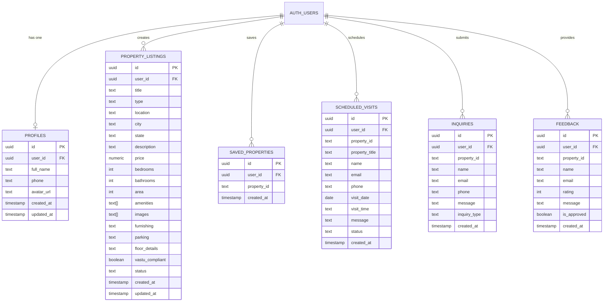
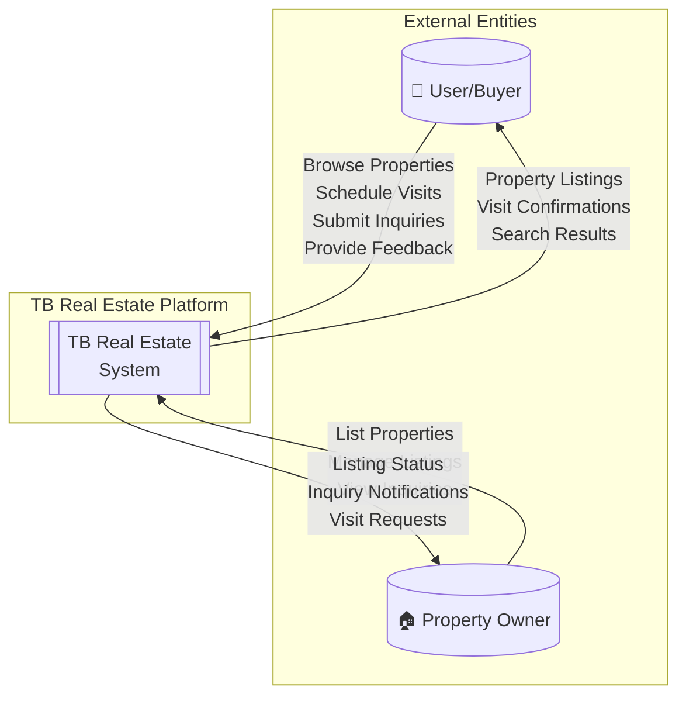
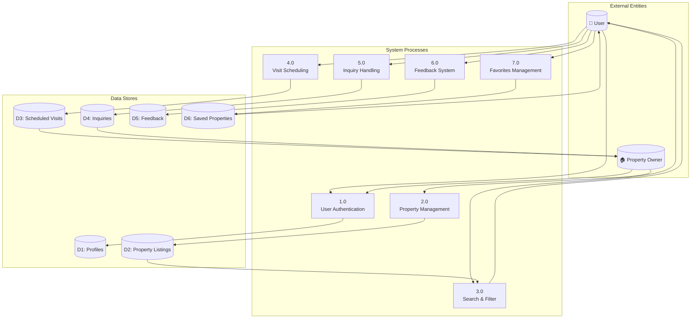
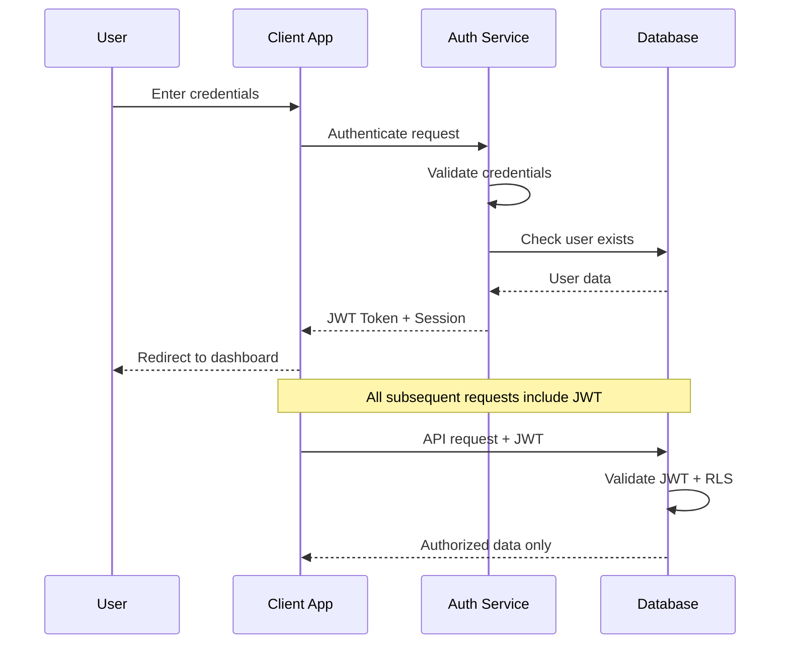

# Agile Project Documentation

**(For MCA Semester II — Agile CI-Based Project)**

---

## Project Title

**TB Real Estate Platform – Property Listing & Management System**

**Project Status:** 🟡 **Under Development / In Progress**

**Last Updated:** January 2026

---

## 1. Project Overview

### Team Members

| Role | Member |
|------|--------|
| **Scrum Master, Frontend Developer** | Thejazo Tachu |
| **Product Owner, Backend Developer, Tester** | Bageesh Kumar Sharma |

### Abstract

TB Real Estate is a modern, responsive real estate property listing platform designed to connect home buyers with suitable residential properties across **12 Indian states**. The platform supports property types including **1BHK to 4BHK apartments, Villas, and Duplex homes**.

The platform provides:
- Intuitive property browsing with advanced filtering
- Detailed property information with image galleries
- User authentication and profile management
- Property saving and visit scheduling
- Property comparison tools
- Inquiry and feedback systems

**Current Development Phase:** Sprint 3 - Enhancement & Polish

The project follows **Agile methodology** with incremental development and continuous improvement. The frontend is implemented using **React 18 with TypeScript**, while the backend uses **Lovable Cloud (PostgreSQL)** with **Row Level Security (RLS)** policies.

---

## 2. Technology Stack (Implemented)

### Frontend Technologies
| Technology | Purpose | Status |
|------------|---------|--------|
| React 18 | UI Framework | ✅ Implemented |
| TypeScript | Type Safety | ✅ Implemented |
| Vite | Build Tool | ✅ Implemented |
| Tailwind CSS | Styling | ✅ Implemented |
| shadcn/ui | Component Library | ✅ Implemented |
| React Router DOM v6 | Routing | ✅ Implemented |
| TanStack React Query | Server State | ✅ Implemented |
| React Hook Form + Zod | Form Handling | ✅ Implemented |
| Lucide React | Icons | ✅ Implemented |

### Backend Technologies
| Technology | Purpose | Status |
|------------|---------|--------|
| Lovable Cloud | Backend Infrastructure | ✅ Implemented |
| PostgreSQL | Database | ✅ Implemented |
| Supabase Auth | Authentication | ✅ Implemented |
| Row Level Security | Data Protection | ✅ Implemented |

---

## 3. System Architecture

### High-Level Architecture

```
┌─────────────────────────────────────────────────────────────────┐
│                        CLIENT LAYER                              │
│  ┌─────────────┐  ┌─────────────┐  ┌─────────────┐              │
│  │   Desktop   │  │   Tablet    │  │   Mobile    │              │
│  └─────────────┘  └─────────────┘  └─────────────┘              │
└─────────────────────────────────────────────────────────────────┘
                              │
                              ▼
┌─────────────────────────────────────────────────────────────────┐
│                     PRESENTATION LAYER                           │
│  ┌──────────────────────────────────────────────────────────┐   │
│  │  React 18 + TypeScript + Vite + Tailwind CSS + shadcn/ui │   │
│  └──────────────────────────────────────────────────────────┘   │
└─────────────────────────────────────────────────────────────────┘
                              │
                              ▼
┌─────────────────────────────────────────────────────────────────┐
│                      BACKEND LAYER                               │
│  ┌─────────────────────┐  ┌─────────────────────────────────┐   │
│  │  Lovable Cloud API  │  │  Authentication (Email/Password) │   │
│  └─────────────────────┘  └─────────────────────────────────┘   │
└─────────────────────────────────────────────────────────────────┘
                              │
                              ▼
┌─────────────────────────────────────────────────────────────────┐
│                       DATA LAYER                                 │
│  ┌─────────────────────────────────────────────────────────┐    │
│  │  PostgreSQL Database with Row Level Security (RLS)       │    │
│  │  Tables: profiles, property_listings, saved_properties,  │    │
│  │          scheduled_visits, inquiries, feedback           │    │
│  └─────────────────────────────────────────────────────────┘    │
└─────────────────────────────────────────────────────────────────┘
```

---

## 4. Database Design

### Entity-Relationship (ER) Diagram



### Table Specifications

| Table | Records | RLS Policies | Status |
|-------|---------|--------------|--------|
| `profiles` | User profiles | User-specific access | ✅ Active |
| `property_listings` | Property data | Owner + approved public | ✅ Active |
| `saved_properties` | User favorites | User-specific | ✅ Active |
| `scheduled_visits` | Visit bookings | User-specific | ✅ Active |
| `inquiries` | Property inquiries | Owner view | ✅ Active |
| `feedback` | User reviews | Approved public | ✅ Active |

---

## 5. Data Flow Diagram (DFD)

### Level 0 - Context Diagram



### Level 1 - Detailed DFD



---

## 6. Problem Statement

Traditional real estate platforms face several challenges:

| Problem | Impact | Our Solution |
|---------|--------|--------------|
| Cluttered UI | Poor user experience | Modern, clean React-based interface |
| Poor discovery | Users can't find properties | Advanced filtering by location, price, BHK |
| Limited comparison | Difficult decision-making | Built-in property comparison tool |
| Incomplete information | Uninformed decisions | Detailed specs + image galleries |
| No visit scheduling | Manual coordination | Integrated visit booking system |
| No authentication | No personalization | Email/password auth with profiles |

---

## 7. Agile Setup

### 7.1 Methodology Followed

- ✅ Sprint-based development (2-week sprints)
- ✅ User stories with acceptance criteria
- ✅ Incremental feature delivery
- ✅ Continuous testing during development
- ✅ Regular sprint reviews and retrospectives
- 🔄 CI/CD pipeline (In Progress)

### 7.2 Team Roles & Responsibilities

| Role | Member | Responsibilities |
|------|--------|------------------|
| Product Owner | Bageesh Kumar Sharma | Define requirements, manage backlog, accept stories |
| Scrum Master | Thejazo Tachu | Facilitate Scrum, remove blockers, ensure practices |
| Frontend Developer | Both | UI/UX, React components, responsive design |
| Backend Developer | Bageesh Kumar Sharma | Database design, RLS policies, API integration |
| Tester | Bageesh Kumar Sharma | Test cases, bug tracking, UAT |
| DevOps | Both | Deployment, version control |

---

## 8. Product Backlog

### Epic 1: Core Platform Development ✅ COMPLETED

| ID | User Story | Status |
|----|-----------|--------|
| US01 | Browse properties by category (1BHK–4BHK, Villas, Duplex) | ✅ Done |
| US02 | Advanced filters (location, price, BHK, state) | ✅ Done |
| US03 | Detailed property information with galleries | ✅ Done |

### Epic 2: User Experience & Interface ✅ COMPLETED

| ID | User Story | Status |
|----|-----------|--------|
| US04 | Responsive interface for all devices | ✅ Done |
| US05 | Clear navigation with header/footer | ✅ Done |

### Epic 3: User Authentication ✅ COMPLETED

| ID | User Story | Status |
|----|-----------|--------|
| US06 | User registration and login | ✅ Done |
| US07 | User profile management | ✅ Done |
| US08 | Session management | ✅ Done |

### Epic 4: Property Interaction ✅ COMPLETED

| ID | User Story | Status |
|----|-----------|--------|
| US09 | Save properties to favorites | ✅ Done |
| US10 | Schedule property visits | ✅ Done |
| US11 | Submit property inquiries | ✅ Done |
| US12 | Property comparison tool | ✅ Done |

### Epic 5: Feedback System ✅ COMPLETED

| ID | User Story | Status |
|----|-----------|--------|
| US13 | Submit feedback with ratings | ✅ Done |
| US14 | View approved testimonials | ✅ Done |

### Epic 6: Property Listing (Owner) 🔄 IN PROGRESS

| ID | User Story | Status |
|----|-----------|--------|
| US15 | List new properties | ✅ Done |
| US16 | View own listings | 🔄 In Progress |
| US17 | Edit/delete own listings | 📋 Planned |

### Epic 7: Future Enhancements 📋 PLANNED

| ID | User Story | Status |
|----|-----------|--------|
| US18 | EMI & mortgage calculator | 📋 Planned |
| US19 | Admin dashboard | 📋 Planned |
| US20 | Email notifications | 📋 Planned |
| US21 | Image upload for listings | 📋 Planned |

---

## 9. Sprint Progress

---

### Sprint 1 (Week 1): Foundation Setup ✅ COMPLETED

**Previous Sprint Reference:**
This was the initial sprint of the project. The team conducted requirement gathering, technology stack finalization, and project environment setup before commencing development.

**Tasks Completed in This Sprint:**

1. Project initialization with Vite, React 18, and TypeScript
2. Installation and configuration of Tailwind CSS and shadcn/ui component library
3. Implementation of responsive Header component with navigation links
4. Development of Footer component with contact information and social links
5. Creation of Home page with hero section and featured properties
6. Development of About page with company information and team section
7. Implementation of Contact page with inquiry form structure
8. Setup of React Router DOM v6 for client-side routing
9. Configuration of responsive layout breakpoints for mobile, tablet, and desktop

**Role-wise Contribution:**

**Thejazo Tachu (Scrum Master, Frontend Developer):**
- Facilitated sprint planning and daily stand-up coordination
- Developed Header and Footer components with responsive design
- Implemented navigation system using React Router
- Created Home page hero section with call-to-action buttons
- Ensured mobile-first responsive design across all pages

**Bageesh Kumar Sharma (Product Owner, Backend Developer, Tester):**
- Defined user stories and acceptance criteria for Sprint 1
- Set up project repository and version control workflow
- Created About page with team information section
- Developed Contact page layout and form structure
- Conducted initial testing of navigation and page routing

**Sprint Outcome:**
Successfully delivered a functional foundation with responsive navigation, three core pages (Home, About, Contact), and established the component architecture for subsequent development.

---

### Sprint 2 (Week 2): Property Features ✅ COMPLETED

**Previous Sprint Reference:**
Building upon the foundation established in Sprint 1, the team proceeded to implement the core property listing functionality. The navigation system and page structure from Week 1 enabled seamless integration of property-related features.

**Tasks Completed in This Sprint:**

1. Creation of comprehensive property data structure with 45+ properties across 12 Indian states
2. Development of Properties listing page with grid layout
3. Implementation of advanced filtering system (location, price range, BHK type, state)
4. Creation of PropertyCard component with image, specifications, and pricing
5. Development of PropertyDetail page with image gallery
6. Implementation of property specifications display (area, bedrooms, bathrooms, amenities)
7. Addition of property type categories (1BHK, 2BHK, 3BHK, 4BHK, Villa, Duplex)
8. Integration of search functionality with real-time filtering
9. Development of Services page with company offerings

**Role-wise Contribution:**

**Thejazo Tachu (Scrum Master, Frontend Developer):**
- Facilitated sprint reviews and backlog refinement sessions
- Developed PropertyCard component with responsive image handling
- Created Properties listing page with filter sidebar
- Implemented advanced filtering logic for multiple criteria
- Designed and developed property image gallery component
- Ensured consistent styling using Tailwind CSS design tokens

**Bageesh Kumar Sharma (Product Owner, Backend Developer, Tester):**
- Curated property data for 45+ listings across multiple states
- Designed property data schema with comprehensive attributes
- Developed PropertyDetail page with full specifications
- Created Services page with service offerings
- Conducted functional testing of filter combinations
- Validated property data accuracy and consistency

**Sprint Outcome:**
Delivered a fully functional property browsing system with advanced filtering, detailed property views with image galleries, and comprehensive property information across multiple Indian states.

---

### Sprint 3 (Week 3): User Authentication & Interactions ✅ COMPLETED

**Previous Sprint Reference:**
With the property listing and filtering system completed in Sprint 2, the team focused on implementing user authentication and interactive features. The property infrastructure enabled the development of user-specific functionalities.

**Tasks Completed in This Sprint:**

1. Integration of Lovable Cloud (PostgreSQL) backend infrastructure
2. Implementation of user authentication system (email/password signup and login)
3. Creation of user profiles table with RLS (Row Level Security) policies
4. Development of saved properties functionality with database persistence
5. Implementation of schedule visit modal with date and time selection
6. Creation of scheduled_visits table with user-specific RLS policies
7. Development of inquiry submission system with database storage
8. Implementation of feedback/testimonials system with rating functionality
9. Creation of My Visits page for viewing scheduled appointments
10. Development of Saved Properties page for viewing favorites
11. Implementation of UserMenu component with authentication state handling

**Role-wise Contribution:**

**Thejazo Tachu (Scrum Master, Frontend Developer):**
- Coordinated sprint activities and resolved blockers
- Developed Auth page with signup and login forms
- Created ScheduleVisitModal component with form validation
- Implemented UserMenu component with dropdown navigation
- Developed My Visits page with visit listing
- Created Saved Properties page with property cards
- Implemented toast notifications for user feedback

**Bageesh Kumar Sharma (Product Owner, Backend Developer, Tester):**
- Designed and implemented database schema for all tables
- Created RLS policies for profiles, saved_properties, scheduled_visits, inquiries, and feedback tables
- Integrated Supabase authentication with email/password
- Developed AuthContext for global authentication state management
- Implemented database queries for CRUD operations
- Conducted end-to-end testing of authentication flows
- Validated RLS policy enforcement and data security

**Sprint Outcome:**
Delivered a complete user management system with secure authentication, personalized features (saved properties, scheduled visits), and fully functional inquiry and feedback systems with database persistence and Row Level Security.

---

### Sprint 4 (Week 4): Enhancement, Email Integration & Documentation 🔄 CURRENT

**Previous Sprint Reference:**
Following the successful implementation of authentication and user interaction features in Sprint 3, the current sprint focuses on enhancing the platform with email notifications, property comparison tools, and comprehensive documentation for academic submission.

**Tasks Being Completed in This Sprint:**

1. Development of property comparison tool for side-by-side analysis
2. Implementation of email notification system using Resend API
3. Creation of send-email edge function for automated notifications
4. Integration of welcome email on user registration
5. Implementation of visit confirmation emails
6. Addition of inquiry and feedback confirmation emails
7. Expansion of property listings with additional properties per state
8. Removal of "Independent House" from property type filters
9. UI/UX improvements and responsive design refinements
10. Performance optimization and code refactoring
11. Completion of Agile project documentation with ER and DFD diagrams
12. Cross-browser compatibility testing

**Role-wise Contribution:**

**Thejazo Tachu (Scrum Master, Frontend Developer):**
- Facilitating final sprint ceremonies and documentation reviews
- Developing PropertyComparison component with comparison modal
- Implementing UI enhancements for property cards and listings
- Refining responsive design for mobile devices
- Updating filter options and removing deprecated property types
- Conducting cross-browser testing on Chrome, Firefox, and Safari
- Preparing frontend documentation and component specifications

**Bageesh Kumar Sharma (Product Owner, Backend Developer, Tester):**
- Developing send-email edge function with Resend API integration
- Implementing email templates for welcome, visit, inquiry, and feedback
- Configuring RESEND_API_KEY secret for email service
- Expanding property data with additional listings across states
- Updating Agile documentation with ER diagrams and DFD
- Conducting integration testing of email notification system
- Performing final UAT (User Acceptance Testing) for all features
- Documenting database schema and security implementation

**Sprint Outcome (Expected):**
Complete platform enhancement with email notifications, property comparison functionality, expanded property listings, and comprehensive academic documentation ready for submission.

---

### Sprint 5 (Week 5): Hardening & Final Deployment 📋 PLANNED

**Previous Sprint Reference:**
Upon completion of Sprint 4's enhancement and documentation phase, the final hardening sprint will focus on production readiness, performance optimization, and final deployment.

**Planned Tasks:**

1. Admin dashboard development for property management
2. Final performance audit and optimization
3. Security review and penetration testing
4. Production deployment and DNS configuration
5. User documentation and help guides
6. Final presentation preparation
7. Project handover documentation

**Role-wise Contribution (Planned):**

**Thejazo Tachu (Scrum Master, Frontend Developer):**
- Admin dashboard UI development
- Final UI polish and accessibility improvements
- Performance optimization for frontend assets
- Preparation of presentation materials

**Bageesh Kumar Sharma (Product Owner, Backend Developer, Tester):**
- Admin dashboard backend functionality
- Final security audit and RLS policy review
- Production deployment configuration
- Complete test case documentation

**Sprint Outcome (Expected):**
Production-ready platform with admin capabilities, optimized performance, and complete documentation for academic evaluation.

---

## 10. Security Implementation

### Row Level Security (RLS) Policies

| Table | Policy | Description |
|-------|--------|-------------|
| `profiles` | User-specific | Users can only CRUD their own profile |
| `property_listings` | Owner + Public approved | Owners see all; public sees approved only |
| `saved_properties` | User-specific | Users manage their own favorites |
| `scheduled_visits` | User-specific | Users see their own visits |
| `inquiries` | Submitter + Owner | Submitters and property owners can view |
| `feedback` | Public approved | Anyone can submit; approved shown publicly |

### Authentication Flow



---

## 11. Testing

### Test Cases

| TC ID | Module | Description | Expected Result | Status |
|-------|--------|-------------|-----------------|--------|
| TC01 | Properties | Filter by location | Filtered results | ✅ Pass |
| TC02 | Properties | Filter by BHK type | Correct listings | ✅ Pass |
| TC03 | Properties | View property details | Full details shown | ✅ Pass |
| TC04 | Auth | User registration | Account created | ✅ Pass |
| TC05 | Auth | User login | Session established | ✅ Pass |
| TC06 | Favorites | Save property | Added to favorites | ✅ Pass |
| TC07 | Visits | Schedule visit | Visit recorded | ✅ Pass |
| TC08 | Inquiry | Submit inquiry | Inquiry saved | ✅ Pass |
| TC09 | Feedback | Submit feedback | Feedback recorded | ✅ Pass |
| TC10 | Compare | Compare properties | Comparison view | ✅ Pass |

---

## 12. Current Project Status

### Completion Summary

| Module | Progress | Status |
|--------|----------|--------|
| Frontend UI | 95% | 🟢 Near Complete |
| Authentication | 100% | ✅ Complete |
| Property Browsing | 100% | ✅ Complete |
| Property Details | 100% | ✅ Complete |
| Search & Filter | 100% | ✅ Complete |
| User Favorites | 100% | ✅ Complete |
| Visit Scheduling | 100% | ✅ Complete |
| Inquiry System | 100% | ✅ Complete |
| Feedback System | 100% | ✅ Complete |
| Property Comparison | 100% | ✅ Complete |
| Property Listing | 80% | 🔄 In Progress |
| Admin Dashboard | 0% | 📋 Planned |
| Email Notifications | 0% | 📋 Planned |

### Overall Project Completion: **~85%**

---

## 13. Future Enhancements

### Phase 2 (Next Sprint)
- [ ] Admin dashboard for property management
- [ ] Email notifications for visits/inquiries
- [ ] Image upload for property listings
- [ ] User profile editing

### Phase 3 (Future)
- [ ] EMI/Mortgage calculator
- [ ] Map-based property view
- [ ] Chat support
- [ ] Mobile app (React Native)

---

## 14. Deliverables

| Deliverable | Status |
|-------------|--------|
| Functional real estate platform | ✅ Delivered |
| GitHub repository | ✅ Available |
| Live deployment | ✅ Available |
| Database with RLS | ✅ Implemented |
| Agile documentation | ✅ This document |
| Technical documentation | ✅ PROJECT_THESIS.md |

---

## 15. Conclusion

The Agile methodology has enabled structured and incremental development of the TB Real Estate Platform. Key achievements include:

- ✅ **Fully functional** property browsing and discovery
- ✅ **Secure authentication** with email/password
- ✅ **Complete user interaction** features (favorites, visits, inquiries)
- ✅ **Responsive design** across all devices
- ✅ **Database security** with RLS policies

**Current Focus:** Completing property listing management and preparing for admin features.

**Next Steps:** Admin dashboard development and email notification integration.

---

*Document Version: 2.0 | Last Updated: January 2026*
*Project Status: 🟡 Under Development*
