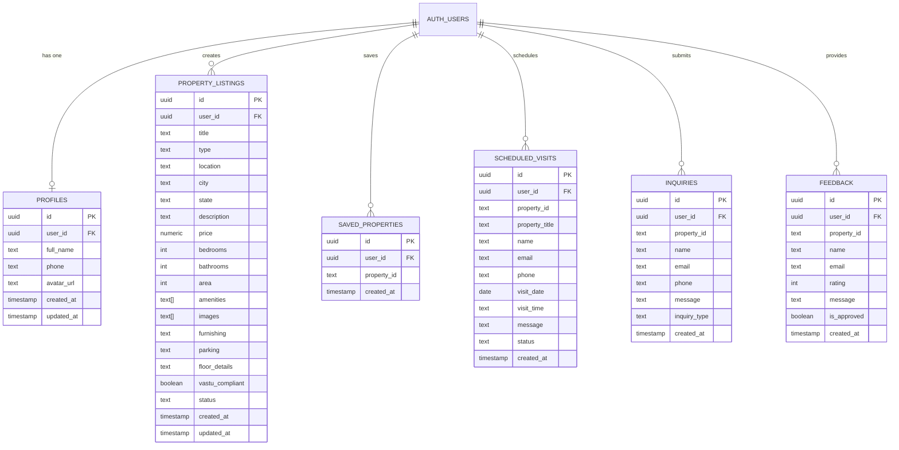
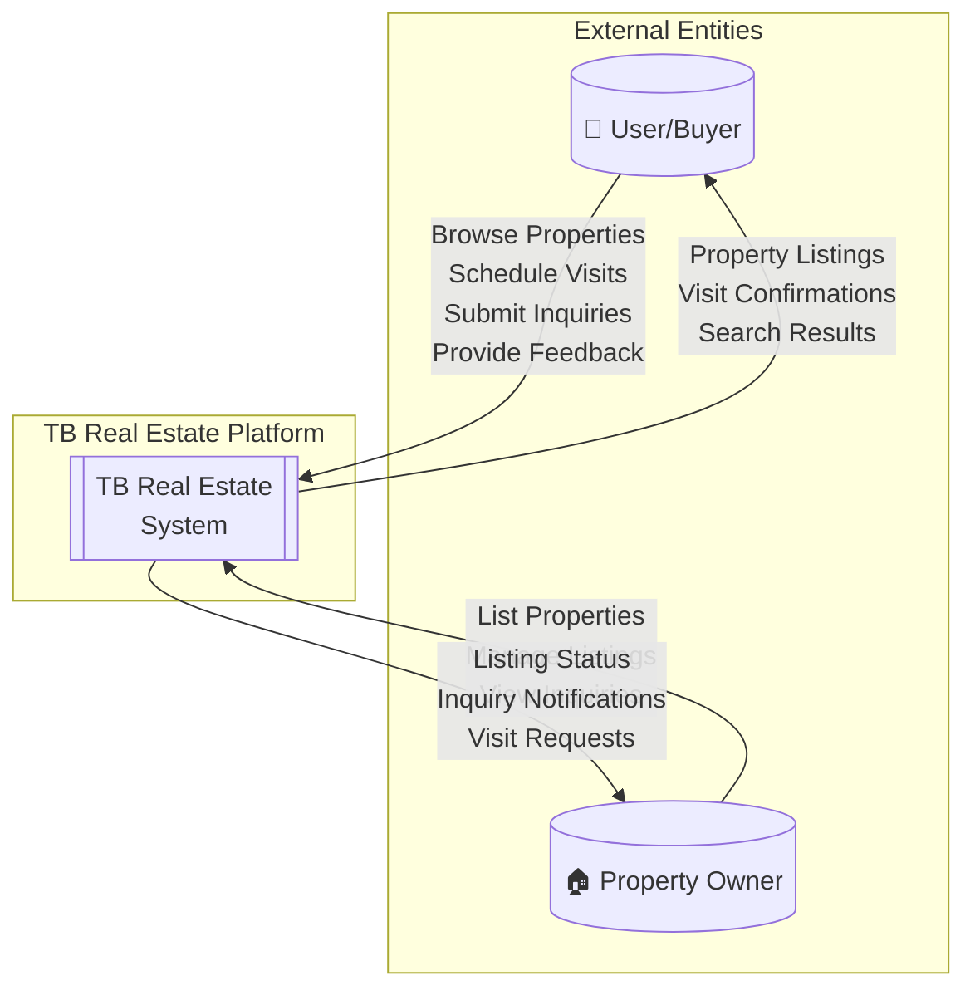
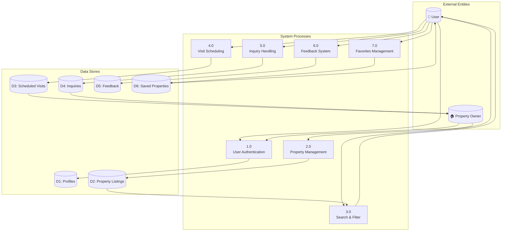
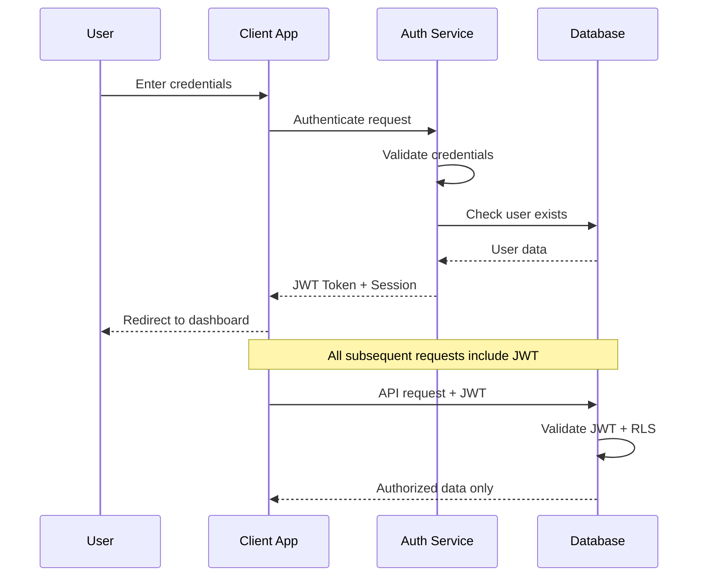

# Agile Project Documentation

**(For MCA Semester II — Agile CI-Based Project)**

---

## Project Title

**TB Real Estate Platform – Property Listing & Management System**

**Project Status:** 🟡 **Under Development / In Progress**

**Last Updated:** January 2026

---

## 1. Project Overview

### Team Members

| Role | Member |
|------|--------|
| **Scrum Master, Frontend Developer** | Thejazo Tachu |
| **Product Owner, Backend Developer, Tester** | Bageesh Kumar Sharma |

### Abstract

TB Real Estate is a modern, responsive real estate property listing platform designed to connect home buyers with suitable residential properties across **12 Indian states**. The platform supports property types including **1BHK to 4BHK apartments, Villas, and Duplex homes**.

The platform provides:
- Intuitive property browsing with advanced filtering
- Detailed property information with image galleries
- User authentication and profile management
- Property saving and visit scheduling
- Property comparison tools
- Inquiry and feedback systems

**Current Development Phase:** Sprint 3 - Enhancement & Polish

The project follows **Agile methodology** with incremental development and continuous improvement. The frontend is implemented using **React 18 with TypeScript**, while the backend uses **Lovable Cloud (PostgreSQL)** with **Row Level Security (RLS)** policies.

---

## 2. Technology Stack (Implemented)

### Frontend Technologies
| Technology | Purpose | Status |
|------------|---------|--------|
| React 18 | UI Framework | ✅ Implemented |
| TypeScript | Type Safety | ✅ Implemented |
| Vite | Build Tool | ✅ Implemented |
| Tailwind CSS | Styling | ✅ Implemented |
| shadcn/ui | Component Library | ✅ Implemented |
| React Router DOM v6 | Routing | ✅ Implemented |
| TanStack React Query | Server State | ✅ Implemented |
| React Hook Form + Zod | Form Handling | ✅ Implemented |
| Lucide React | Icons | ✅ Implemented |

### Backend Technologies
| Technology | Purpose | Status |
|------------|---------|--------|
| Lovable Cloud | Backend Infrastructure | ✅ Implemented |
| PostgreSQL | Database | ✅ Implemented |
| Supabase Auth | Authentication | ✅ Implemented |
| Row Level Security | Data Protection | ✅ Implemented |

---

## 3. System Architecture

### High-Level Architecture

```
┌─────────────────────────────────────────────────────────────────┐
│                        CLIENT LAYER                              │
│  ┌─────────────┐  ┌─────────────┐  ┌─────────────┐              │
│  │   Desktop   │  │   Tablet    │  │   Mobile    │              │
│  └─────────────┘  └─────────────┘  └─────────────┘              │
└─────────────────────────────────────────────────────────────────┘
                              │
                              ▼
┌─────────────────────────────────────────────────────────────────┐
│                     PRESENTATION LAYER                           │
│  ┌──────────────────────────────────────────────────────────┐   │
│  │  React 18 + TypeScript + Vite + Tailwind CSS + shadcn/ui │   │
│  └──────────────────────────────────────────────────────────┘   │
└─────────────────────────────────────────────────────────────────┘
                              │
                              ▼
┌─────────────────────────────────────────────────────────────────┐
│                      BACKEND LAYER                               │
│  ┌─────────────────────┐  ┌─────────────────────────────────┐   │
│  │  Lovable Cloud API  │  │  Authentication (Email/Password) │   │
│  └─────────────────────┘  └─────────────────────────────────┘   │
└─────────────────────────────────────────────────────────────────┘
                              │
                              ▼
┌─────────────────────────────────────────────────────────────────┐
│                       DATA LAYER                                 │
│  ┌─────────────────────────────────────────────────────────┐    │
│  │  PostgreSQL Database with Row Level Security (RLS)       │    │
│  │  Tables: profiles, property_listings, saved_properties,  │    │
│  │          scheduled_visits, inquiries, feedback           │    │
│  └─────────────────────────────────────────────────────────┘    │
└─────────────────────────────────────────────────────────────────┘
```

---

## 4. Database Design

### Entity-Relationship (ER) Diagram



### Table Specifications

| Table | Records | RLS Policies | Status |
|-------|---------|--------------|--------|
| `profiles` | User profiles | User-specific access | ✅ Active |
| `property_listings` | Property data | Owner + approved public | ✅ Active |
| `saved_properties` | User favorites | User-specific | ✅ Active |
| `scheduled_visits` | Visit bookings | User-specific | ✅ Active |
| `inquiries` | Property inquiries | Owner view | ✅ Active |
| `feedback` | User reviews | Approved public | ✅ Active |

---

## 5. Data Flow Diagram (DFD)

### Level 0 - Context Diagram



### Level 1 - Detailed DFD



---

## 6. Problem Statement

Traditional real estate platforms face several challenges:

| Problem | Impact | Our Solution |
|---------|--------|--------------|
| Cluttered UI | Poor user experience | Modern, clean React-based interface |
| Poor discovery | Users can't find properties | Advanced filtering by location, price, BHK |
| Limited comparison | Difficult decision-making | Built-in property comparison tool |
| Incomplete information | Uninformed decisions | Detailed specs + image galleries |
| No visit scheduling | Manual coordination | Integrated visit booking system |
| No authentication | No personalization | Email/password auth with profiles |

---

## 7. Agile Setup

### 7.1 Methodology Followed

- ✅ Sprint-based development (2-week sprints)
- ✅ User stories with acceptance criteria
- ✅ Incremental feature delivery
- ✅ Continuous testing during development
- ✅ Regular sprint reviews and retrospectives
- 🔄 CI/CD pipeline (In Progress)

### 7.2 Team Roles & Responsibilities

| Role | Member | Responsibilities |
|------|--------|------------------|
| Product Owner | Bageesh Kumar Sharma | Define requirements, manage backlog, accept stories |
| Scrum Master | Thejazo Tachu | Facilitate Scrum, remove blockers, ensure practices |
| Frontend Developer | Both | UI/UX, React components, responsive design |
| Backend Developer | Bageesh Kumar Sharma | Database design, RLS policies, API integration |
| Tester | Bageesh Kumar Sharma | Test cases, bug tracking, UAT |
| DevOps | Both | Deployment, version control |

---

## 8. Product Backlog

### Epic 1: Core Platform Development ✅ COMPLETED

| ID | User Story | Status |
|----|-----------|--------|
| US01 | Browse properties by category (1BHK–4BHK, Villas, Duplex) | ✅ Done |
| US02 | Advanced filters (location, price, BHK, state) | ✅ Done |
| US03 | Detailed property information with galleries | ✅ Done |

### Epic 2: User Experience & Interface ✅ COMPLETED

| ID | User Story | Status |
|----|-----------|--------|
| US04 | Responsive interface for all devices | ✅ Done |
| US05 | Clear navigation with header/footer | ✅ Done |

### Epic 3: User Authentication ✅ COMPLETED

| ID | User Story | Status |
|----|-----------|--------|
| US06 | User registration and login | ✅ Done |
| US07 | User profile management | ✅ Done |
| US08 | Session management | ✅ Done |

### Epic 4: Property Interaction ✅ COMPLETED

| ID | User Story | Status |
|----|-----------|--------|
| US09 | Save properties to favorites | ✅ Done |
| US10 | Schedule property visits | ✅ Done |
| US11 | Submit property inquiries | ✅ Done |
| US12 | Property comparison tool | ✅ Done |

### Epic 5: Feedback System ✅ COMPLETED

| ID | User Story | Status |
|----|-----------|--------|
| US13 | Submit feedback with ratings | ✅ Done |
| US14 | View approved testimonials | ✅ Done |

### Epic 6: Property Listing (Owner) 🔄 IN PROGRESS

| ID | User Story | Status |
|----|-----------|--------|
| US15 | List new properties | ✅ Done |
| US16 | View own listings | 🔄 In Progress |
| US17 | Edit/delete own listings | 📋 Planned |

### Epic 7: Future Enhancements 📋 PLANNED

| ID | User Story | Status |
|----|-----------|--------|
| US18 | EMI & mortgage calculator | 📋 Planned |
| US19 | Admin dashboard | 📋 Planned |
| US20 | Email notifications | 📋 Planned |
| US21 | Image upload for listings | 📋 Planned |

---

## 9. Sprint Progress

### Sprint 1: Foundation Setup ✅ COMPLETED
**Goal:** Platform structure and core pages
- ✅ Header, Footer, Navigation
- ✅ Home, About, Contact, Services pages
- ✅ Routing and responsive layout

### Sprint 2: Property Features ✅ COMPLETED
**Goal:** Property listing and filtering
- ✅ Property listing page with filtering
- ✅ Property detail pages with galleries
- ✅ Search functionality

### Sprint 3: User Features ✅ COMPLETED
**Goal:** Authentication and user interactions
- ✅ User authentication (signup/login)
- ✅ Saved properties feature
- ✅ Visit scheduling
- ✅ Inquiry forms
- ✅ Feedback system

### Sprint 4: Enhancement & Polish 🔄 CURRENT
**Goal:** Bug fixes, optimization, documentation
- ✅ Property comparison tool
- ✅ UI/UX improvements
- 🔄 Performance optimization
- 🔄 Documentation completion
- 📋 Cross-browser testing

### Hard Sprint 📋 PLANNED
- Admin dashboard
- Email notifications
- Performance audit
- Final deployment
- Complete documentation

---

## 10. Security Implementation

### Row Level Security (RLS) Policies

| Table | Policy | Description |
|-------|--------|-------------|
| `profiles` | User-specific | Users can only CRUD their own profile |
| `property_listings` | Owner + Public approved | Owners see all; public sees approved only |
| `saved_properties` | User-specific | Users manage their own favorites |
| `scheduled_visits` | User-specific | Users see their own visits |
| `inquiries` | Submitter + Owner | Submitters and property owners can view |
| `feedback` | Public approved | Anyone can submit; approved shown publicly |

### Authentication Flow



---

## 11. Testing

### Test Cases

| TC ID | Module | Description | Expected Result | Status |
|-------|--------|-------------|-----------------|--------|
| TC01 | Properties | Filter by location | Filtered results | ✅ Pass |
| TC02 | Properties | Filter by BHK type | Correct listings | ✅ Pass |
| TC03 | Properties | View property details | Full details shown | ✅ Pass |
| TC04 | Auth | User registration | Account created | ✅ Pass |
| TC05 | Auth | User login | Session established | ✅ Pass |
| TC06 | Favorites | Save property | Added to favorites | ✅ Pass |
| TC07 | Visits | Schedule visit | Visit recorded | ✅ Pass |
| TC08 | Inquiry | Submit inquiry | Inquiry saved | ✅ Pass |
| TC09 | Feedback | Submit feedback | Feedback recorded | ✅ Pass |
| TC10 | Compare | Compare properties | Comparison view | ✅ Pass |

---

## 12. Current Project Status

### Completion Summary

| Module | Progress | Status |
|--------|----------|--------|
| Frontend UI | 95% | 🟢 Near Complete |
| Authentication | 100% | ✅ Complete |
| Property Browsing | 100% | ✅ Complete |
| Property Details | 100% | ✅ Complete |
| Search & Filter | 100% | ✅ Complete |
| User Favorites | 100% | ✅ Complete |
| Visit Scheduling | 100% | ✅ Complete |
| Inquiry System | 100% | ✅ Complete |
| Feedback System | 100% | ✅ Complete |
| Property Comparison | 100% | ✅ Complete |
| Property Listing | 80% | 🔄 In Progress |
| Admin Dashboard | 0% | 📋 Planned |
| Email Notifications | 0% | 📋 Planned |

### Overall Project Completion: **~85%**

---

## 13. Future Enhancements

### Phase 2 (Next Sprint)
- [ ] Admin dashboard for property management
- [ ] Email notifications for visits/inquiries
- [ ] Image upload for property listings
- [ ] User profile editing

### Phase 3 (Future)
- [ ] EMI/Mortgage calculator
- [ ] Map-based property view
- [ ] Chat support
- [ ] Mobile app (React Native)

---

## 14. Deliverables

| Deliverable | Status |
|-------------|--------|
| Functional real estate platform | ✅ Delivered |
| GitHub repository | ✅ Available |
| Live deployment | ✅ Available |
| Database with RLS | ✅ Implemented |
| Agile documentation | ✅ This document |
| Technical documentation | ✅ PROJECT_THESIS.md |

---

## 15. Conclusion

The Agile methodology has enabled structured and incremental development of the TB Real Estate Platform. Key achievements include:

- ✅ **Fully functional** property browsing and discovery
- ✅ **Secure authentication** with email/password
- ✅ **Complete user interaction** features (favorites, visits, inquiries)
- ✅ **Responsive design** across all devices
- ✅ **Database security** with RLS policies

**Current Focus:** Completing property listing management and preparing for admin features.

**Next Steps:** Admin dashboard development and email notification integration.

---

*Document Version: 2.0 | Last Updated: January 2026*
*Project Status: 🟡 Under Development*
